# 实验三：基于卷积神经网络的服装图像分类

题目：改进 LeNet-5 在 Fashion-MNIST 上的分类  
框架：PyTorch 2.4.1（CUDA 11.8）  
设备：NVIDIA GeForce RTX 3090（CPU 亦可复现）

相对经典 LeNet-5 的三处改动：

- 改动 1（激活函数）：tanh 改为 ReLU[3]，并对照 Tanh、GELU[4]、LeakyReLU[5]。
- 改动 2（优化方法）：动量 SGD 改为 Adam[8]，并对照 RMSprop[9]。
- 改动 3（网络结构）：AvgPool 改为 MaxPool[10]，卷积后加 BatchNorm[7]；Dropout[6] 单独扫描，主结果取 p=0。

---

## 1 问题描述

### 1.1 待解决问题、背景与应用前景

图像分类把一张图映射到预定义类别。服装图像的判别主要靠领口、袖长和轮廓，不靠全局颜色。CNN 用局部连接和权值共享提取这类空间特征。LeNet-5 给出了 C1–S2–C3–S4–C5–F6 骨架，最初用于手写数字[1]。

Fashion-MNIST[2] 保持 MNIST 的规模（28×28 灰度，6 万训练 / 1 万测试，10 类均衡），把数字换成服装。衬衫、T 恤、外套、套头衫在低分辨率下外形接近，比手写数字更能看出激活函数、正则化和优化器有没有起作用。这类任务对应商品自动打标和仓储分拣里最简单的一档：小模型、短训练、输出类别。

### 1.2 问题的形式化表述

输入 \(x \in \mathbb{R}^{1\times 32\times 32}\)。原图 28×28，四周补 2 像素零，与 LeNet-5 论文的输入尺寸一致[1]。标签 \(y \in \{0,\ldots,9\}\) 依次为 T 恤、裤子、套头衫、连衣裙、外套、凉鞋、衬衫、运动鞋、包、短靴。网络 \(f_\theta\) 输出 10 维 logits，

\[
\hat{y}=\arg\max_{k}\operatorname{softmax}(f_\theta(x))_k.
\]

训练目标是带 \(\ell_2\) 正则的交叉熵，\(\lambda=10^{-4}\)：

\[
\mathcal{L}(\theta)=-\frac{1}{N}\sum_{i=1}^{N}\log\operatorname{softmax}(f_\theta(x_i))_{y_i}+\lambda\|\theta\|_2^2.
\]

验证集只用来按准确率存检查点。测试集在训练结束后评估一次，不参与选参。

### 1.3 解决方案与算法

对照实验保持骨架和宽度不变（6→16→120→84→10），每次只改一个因素。经典对照：tanh、AvgPool、无 BN、无 Dropout、动量 SGD。改进模型在同一宽度上叠加三处改动，再分别扫激活、Dropout 比例和优化器。测试集差异因此来自被改动的那一项，而不是参数量或划分不同。第二层卷积用现在通行的全连接 C3。

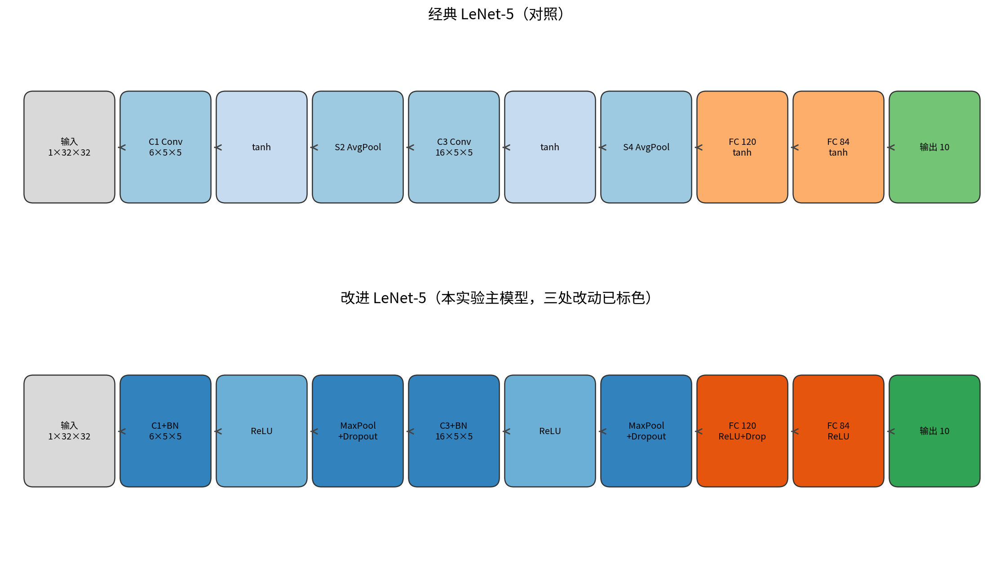

改进模型前向：

\[
\begin{aligned}
h_1&=\operatorname{Dropout2d}_p\big(\operatorname{MaxPool}(\sigma(\operatorname{BN}(\operatorname{Conv}_{6,5\times5}(x))))\big),\\
h_2&=\operatorname{Dropout2d}_p\big(\operatorname{MaxPool}(\sigma(\operatorname{BN}(\operatorname{Conv}_{16,5\times5}(h_1))))\big),\\
z&=W_3\,\sigma\big(W_2\,\operatorname{Dropout}_p(\sigma(W_1\operatorname{vec}(h_2)))\big).
\end{aligned}
\]

```
算法  ImprovedLeNet-Train
输入: D, V, T, 激活 σ, Dropout p, 优化器 Opt, 学习率 η, 轮数 E, 种子 s
输出: 测试 Acc、Macro-F1、混淆矩阵

1.  set_seed(s)，按 s 重建 DataLoader
2.  Pad(2)，Normalize(0.5, 0.5)
3.  构造 f_θ
4.  for e = 1 to E:
5.      for (X, y) in D:
6.          θ ← Opt(θ, ∇ CrossEntropy(f_θ(X), y), η)
7.      在 V 上 eval，准确率升高则保存 θ*
8.  用 θ* 在 T 上报告指标
```

---

## 2 实验设置及分析

### 2.1 数据集、样例、规模与实验环境

Fashion-MNIST：训练 60,000，测试 10,000，每类均衡。种子 42 从训练集划出 10% 作验证，实际为训练 54,000、验证 6,000、测试 10,000。像素先补到 32×32，再线性映射到 [-1,1]。样例如下。

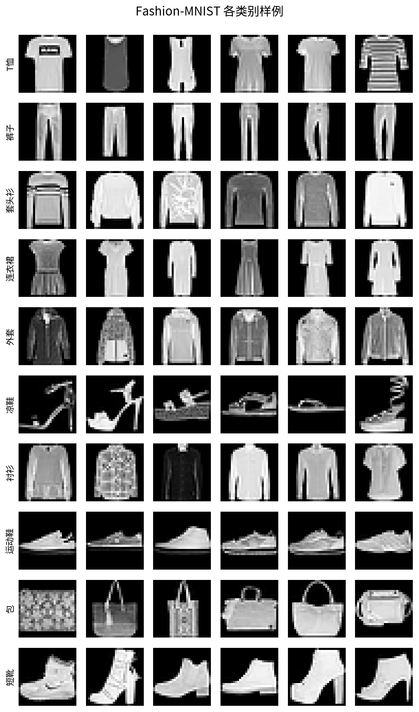

本机记录：Python 3.10.13，PyTorch 2.4.1+cu118，RTX 3090。batch size 128，15 epoch。SGD 学习率 0.01（动量 0.9），Adam / RMSprop 为 1e-3。每个配置在 `set_seed(42)` 后重建 DataLoader，避免 shuffle 状态跨实验漂移。报出的测试指标来自验证集最优检查点。改进模型 61,750 参数，经典 61,706，容量同级。单配置约 1 分钟。环境写入 `results/run_manifest.json`。代码不绑定机器路径，有 CUDA 用 GPU，没有则走 CPU。

### 2.2 实验评价标准

主指标：测试集 Top-1 准确率。Macro-F1 按 10 类等权平均。混淆矩阵和逐类 F1 用来看错在哪几类。验证曲线看收敛。划分和种子全组共用；验证集只选检查点。

### 2.3 实验结果

九组配置顺序跑完。主结果是 ReLU + BatchNorm + MaxPool + Adam，Dropout p=0：测试准确率 90.45%，Macro-F1 0.9046，测试损失 0.2674。经典 LeNet-5 为 88.74% / 0.8869，相差 1.71 个百分点。该配置的验证准确率也最高（90.77%）。

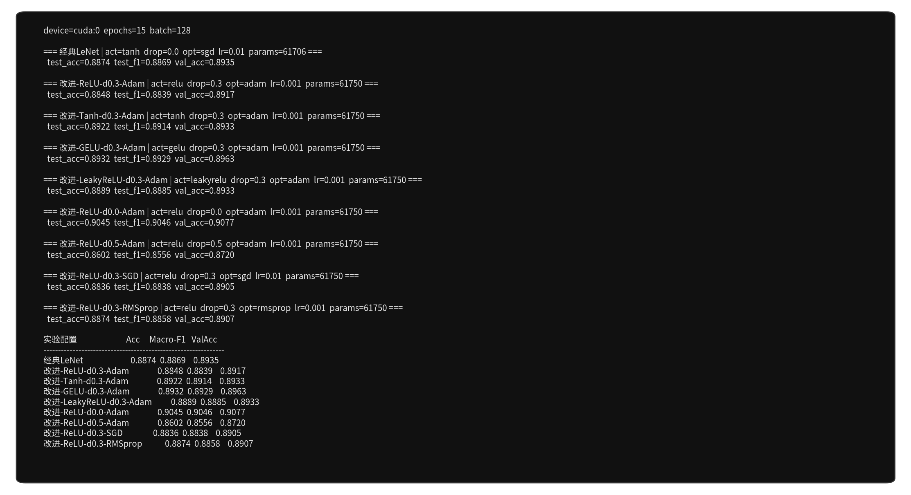

| 配置 | 实验角色 | Test Acc | Macro-F1 | 最佳 Val Acc | Test Loss |
|------|----------|----------|----------|--------------|-----------|
| 经典LeNet | 基线：tanh + AvgPool + SGD | 0.8874 | 0.8869 | 0.8935 | 0.3052 |
| 改进-ReLU-d0.3-Adam | 三处改动 + Dropout 0.3 | 0.8848 | 0.8839 | 0.8917 | 0.3086 |
| 改进-Tanh-d0.3-Adam | 激活消融 | 0.8922 | 0.8914 | 0.8933 | 0.3037 |
| 改进-GELU-d0.3-Adam | 激活消融 | 0.8932 | 0.8929 | 0.8963 | 0.2915 |
| 改进-LeakyReLU-d0.3-Adam | 激活消融 | 0.8889 | 0.8885 | 0.8933 | 0.3044 |
| 改进-ReLU-d0.0-Adam | 主模型 | 0.9045 | 0.9046 | 0.9077 | 0.2674 |
| 改进-ReLU-d0.5-Adam | Dropout 扫描 | 0.8602 | 0.8556 | 0.8720 | 0.3602 |
| 改进-ReLU-d0.3-SGD | 优化器消融 | 0.8836 | 0.8838 | 0.8905 | 0.3145 |
| 改进-ReLU-d0.3-RMSprop | 优化器消融 | 0.8874 | 0.8858 | 0.8907 | 0.3126 |

验证曲线上，p=0 的损失最低、准确率最高，15 个 epoch 内稳住。

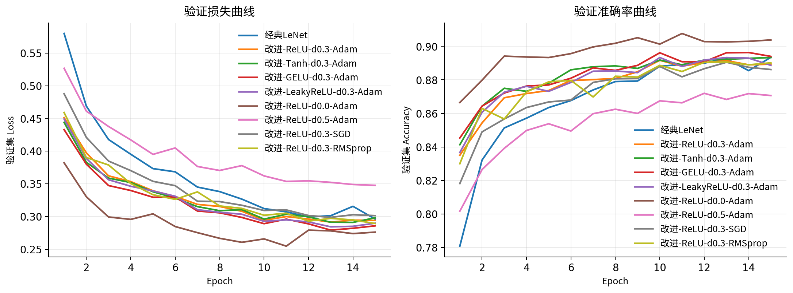

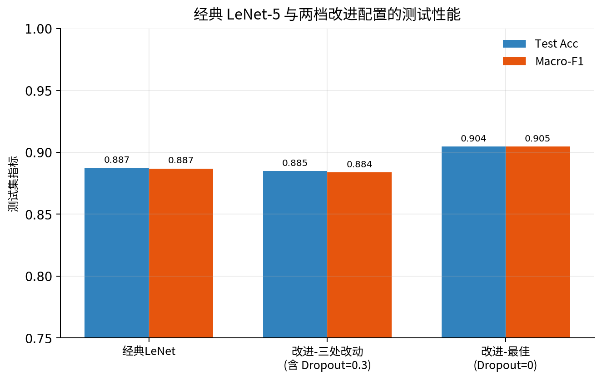

改动 1。固定 BN、MaxPool、Dropout=0.3 和 Adam 后，四种激活的测试准确率在 88.48%–89.32%。这一档里 GELU 最高（89.32%）。主模型仍用 ReLU，因为它和 p=0 组成全局最好的一组。

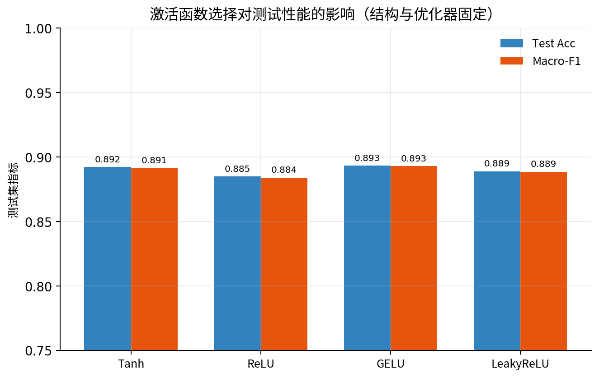

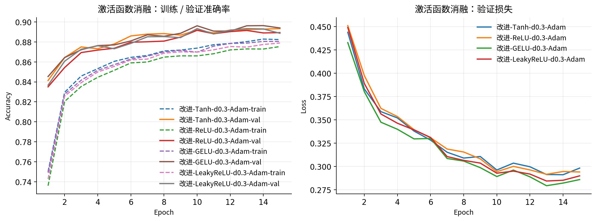

改动 3。固定 ReLU、BN、MaxPool 和 Adam，p 取 0 / 0.3 / 0.5：测试准确率分别为 90.45%、88.48%、86.02%。Dropout 是为过参数化网络准备的。这里大约 6.2 万参数、5.4 万训练样本，容量和数据同量级，BN 已经在稳训练。对这个 LeNet，工作点在 p=0。

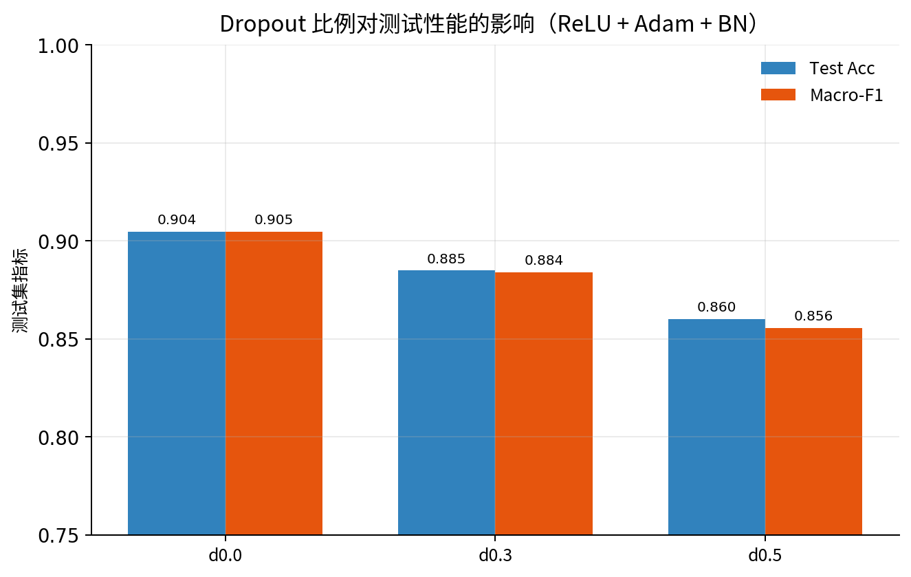

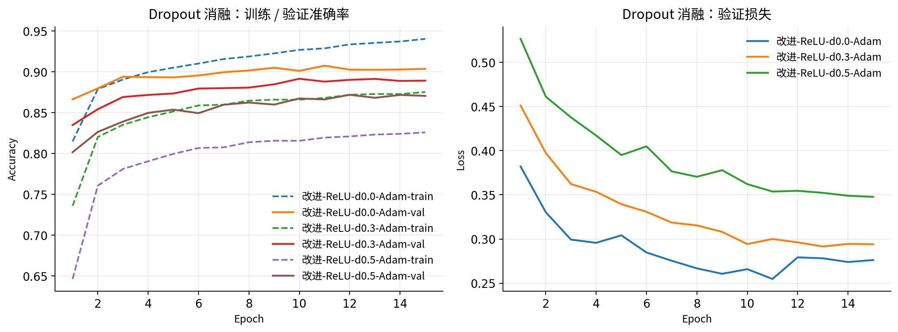

改动 2。固定 ReLU、Dropout=0.3、BN 和 MaxPool，15 epoch、各优化器常用学习率下，Adam 和 RMSprop 的验证曲线升得更快。主模型用 Adam，在 p=0 上测到 90.45%。比较口径是固定轮数加常用学习率，也就是这次作业的训练预算。

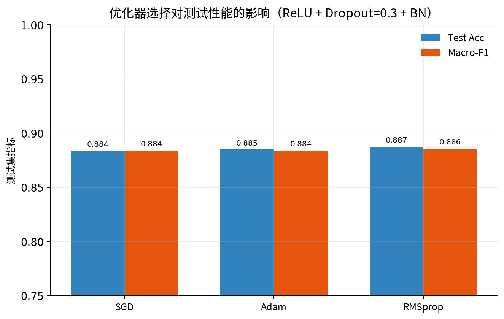

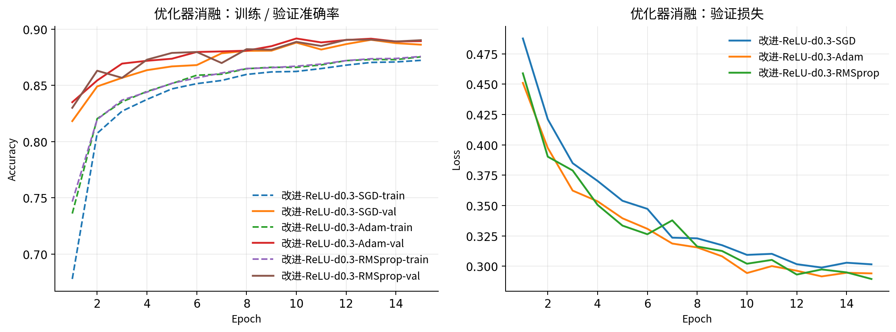

第一层 6 个卷积核的特征图见下。短靴和裤子剪影完整；套头衫的响应对在边缘和高亮区。

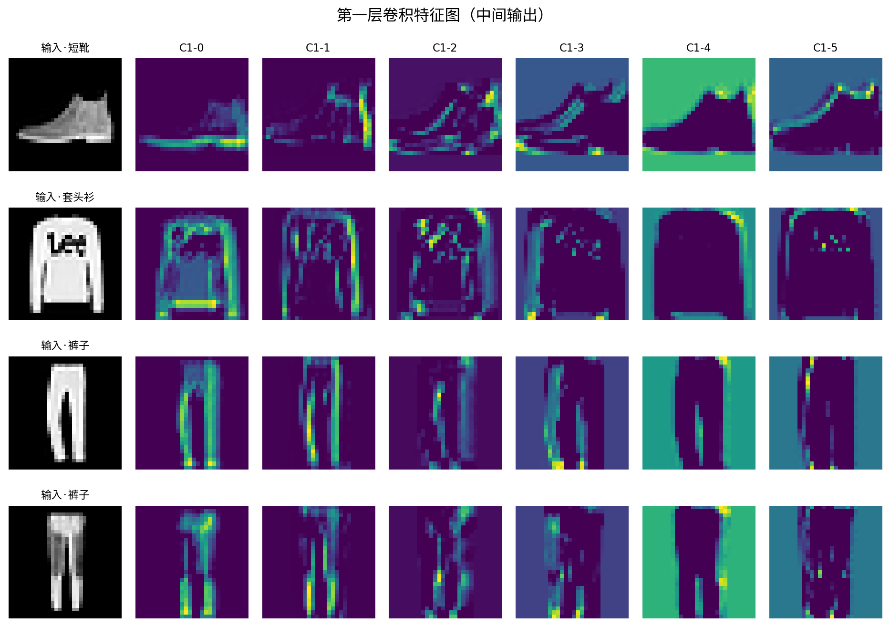

主模型混淆矩阵对角占优。裤子、凉鞋、包、短靴几乎不分错。剩下的错误集中在 T 恤、衬衫、套头衫、外套。28×28 里这几类外形本来就近。

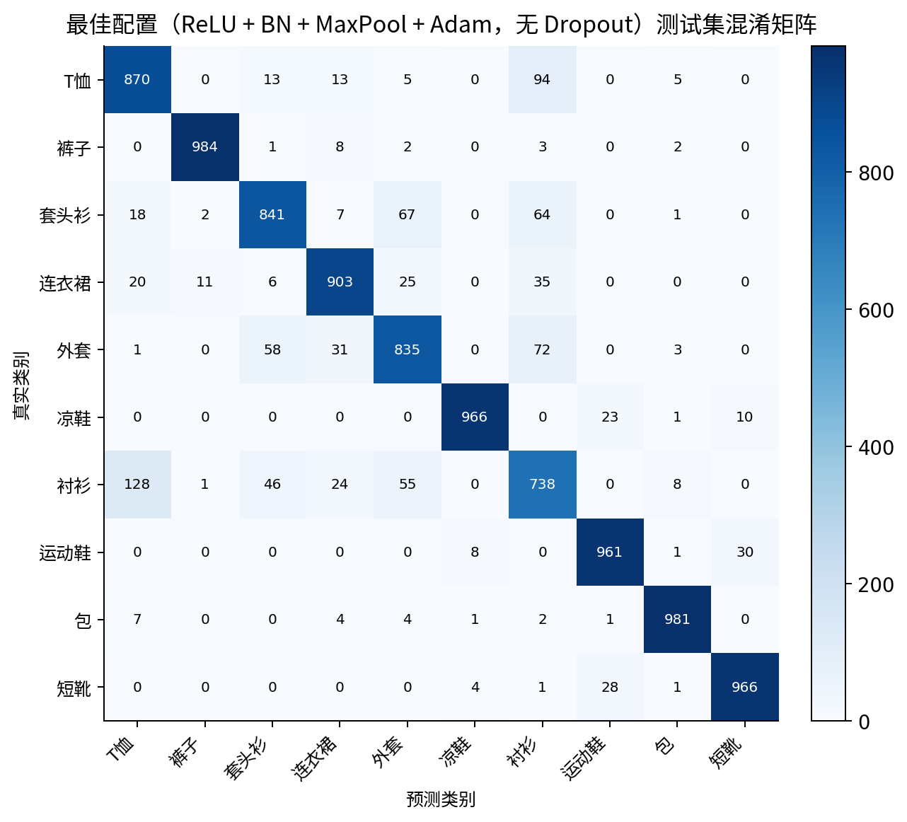

---

## 3 实验讨论与 Case Study

改进后测试准确率从 88.74% 到 90.45%。难类也一起上去：衬衫 F1 0.692 → 0.735，套头衫 0.805 → 0.856，T 恤 0.829 → 0.851。ReLU、BN 和 MaxPool 出局部特征，Adam 在 15 轮里把损失压下来，Dropout 按这个网络的容量取 p=0。

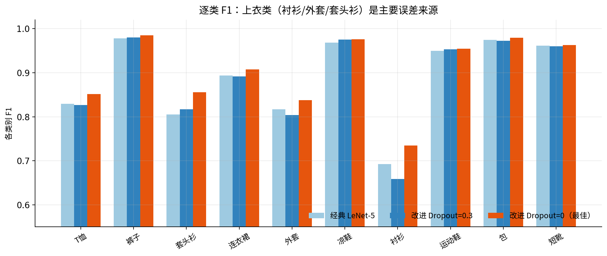

错例几乎都是上装互认：衬衫看成套头衫，T 恤看成衬衫，套头衫看成外套。领口和门襟在 28×28 里只有几个像素。连衣裙下摆收成一块深色时，轮廓会像包。对的例子多是裤子、短靴、包、凉鞋，外轮廓本身分得开，和 C1 特征图、混淆矩阵对角一致。

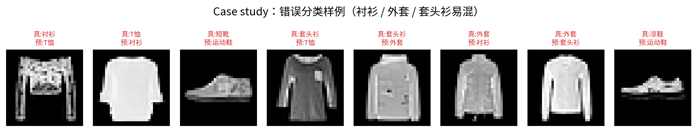

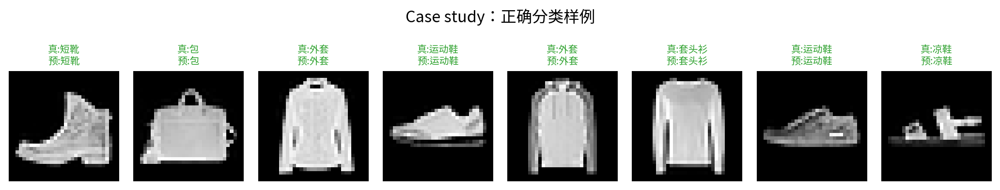

三处改动与证据对应：

| 编号 | 相对原版 LeNet-5 | 证据 |
|------|------------------|------|
| 改动 1 | tanh → ReLU（并测 GELU / LeakyReLU / Tanh） | 激活消融；与 p=0 组成 90.45% |
| 改动 2 | SGD → Adam（并测 RMSprop） | 优化器消融；15 epoch、常用学习率 |
| 改动 3 | AvgPool → MaxPool，加 BN；Dropout 取 p=0 | 结构对照 + Dropout 扫描 |

Fashion-MNIST 的类间差距比 MNIST 大，消融差出现在百分位上。协议：种子 42，验证集选优，测试集只评一次。

---

## 4 参考文献

[1] LeCun Y, Bottou L, Bengio Y, Haffner P. Gradient-based learning applied to document recognition. Proceedings of the IEEE, 1998, 86(11): 2278–2324. [https://doi.org/10.1109/5.726791](https://doi.org/10.1109/5.726791)

[2] Xiao H, Rasul K, Vollgraf R. Fashion-MNIST: a novel image dataset for benchmarking machine learning algorithms. arXiv:1708.07747, 2017. [https://arxiv.org/abs/1708.07747](https://arxiv.org/abs/1708.07747)

[3] Nair V, Hinton G E. Rectified linear units improve restricted Boltzmann machines. ICML, 2010. [https://www.cs.toronto.edu/~hinton/absps/reluICML.pdf](https://www.cs.toronto.edu/~hinton/absps/reluICML.pdf)

[4] Hendrycks D, Gimpel K. Gaussian error linear units (GELUs). arXiv:1606.08415, 2016. [https://arxiv.org/abs/1606.08415](https://arxiv.org/abs/1606.08415)

[5] Maas A L, Hannun A Y, Ng A Y. Rectifier nonlinearities improve neural network acoustic models. ICML Workshop, 2013. [https://ai.stanford.edu/~amaas/papers/relu_hybrid_icml2013_final.pdf](https://ai.stanford.edu/~amaas/papers/relu_hybrid_icml2013_final.pdf)

[6] Srivastava N, Hinton G, Krizhevsky A, Sutskever I, Salakhutdinov R. Dropout: a simple way to prevent neural networks from overfitting. JMLR, 2014, 15(56): 1929–1958. [https://jmlr.org/papers/v15/srivastava14a.html](https://jmlr.org/papers/v15/srivastava14a.html)

[7] Ioffe S, Szegedy C. Batch normalization: accelerating deep network training by reducing internal covariate shift. ICML, 2015. [https://proceedings.mlr.press/v37/ioffe15.html](https://proceedings.mlr.press/v37/ioffe15.html)

[8] Kingma D P, Ba J. Adam: a method for stochastic optimization. ICLR, 2015. [https://arxiv.org/abs/1412.6980](https://arxiv.org/abs/1412.6980)

[9] Tieleman T, Hinton G. Lecture 6.5—RMSProp. COURSERA: Neural Networks for Machine Learning, 2012. [https://www.cs.toronto.edu/~tijmen/csc321/slides/lecture_slides_lec6.pdf](https://www.cs.toronto.edu/~tijmen/csc321/slides/lecture_slides_lec6.pdf)

[10] Krizhevsky A, Sutskever I, Hinton G E. ImageNet classification with deep convolutional neural networks. NeurIPS, 2012. [https://proceedings.neurips.cc/paper/2012/hash/c399862d3b9d6b76c8436e924a68c45b-Abstract.html](https://proceedings.neurips.cc/paper/2012/hash/c399862d3b9d6b76c8436e924a68c45b-Abstract.html)

---

## 附录 源代码说明

| 文件 | 作用 |
|------|------|
| `src/models.py` | 经典 / 改进 LeNet |
| `src/data.py` | 划分与按种子重建 DataLoader |
| `src/engine.py` | 训练、验证选优、测试 |
| `src/plots.py` | 作图 |
| `run_experiment.py` | 九组消融入口 |
| `results/run_manifest.json` | 种子、设备、版本 |

代码：https://github.com/yiyun-li/improved-lenet-fashion-mnist

```bash
python -m pip install -r requirements.txt
python run_experiment.py --device auto --epochs 15 --batch-size 128
```

有 GPU 时会自动用 CUDA；指定某张卡可以先 `export CUDA_VISIBLE_DEVICES=0`。数据第一次运行下载到 `./data/`。

```python
class LeNetFamily(nn.Module):
    def __init__(self, activation="relu", pooling="max",
                 use_bn=True, dropout=0.3, num_classes=10):
        super().__init__()
        act_ctor = get_activation(activation)          # 改动1
        pool_cls = nn.MaxPool2d if pooling == "max" else nn.AvgPool2d  # 改动3
        self.conv1 = nn.Conv2d(1, 6, 5)
        self.bn1 = nn.BatchNorm2d(6) if use_bn else nn.Identity()      # 改动3
```

经典对照：`activation="tanh", pooling="avg", use_bn=False, dropout=0`，优化器 SGD。  
主模型：`activation="relu", pooling="max", use_bn=True, dropout=0`，优化器 Adam。
